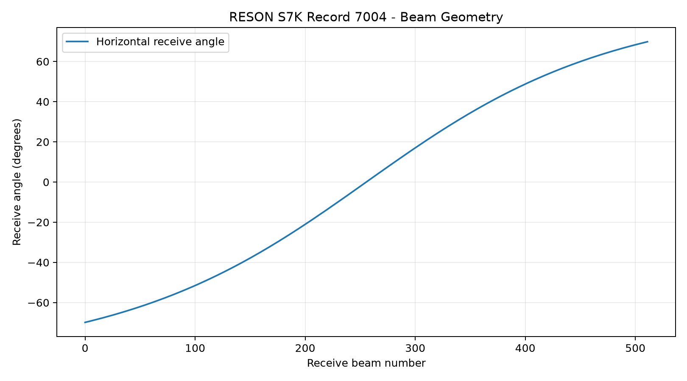
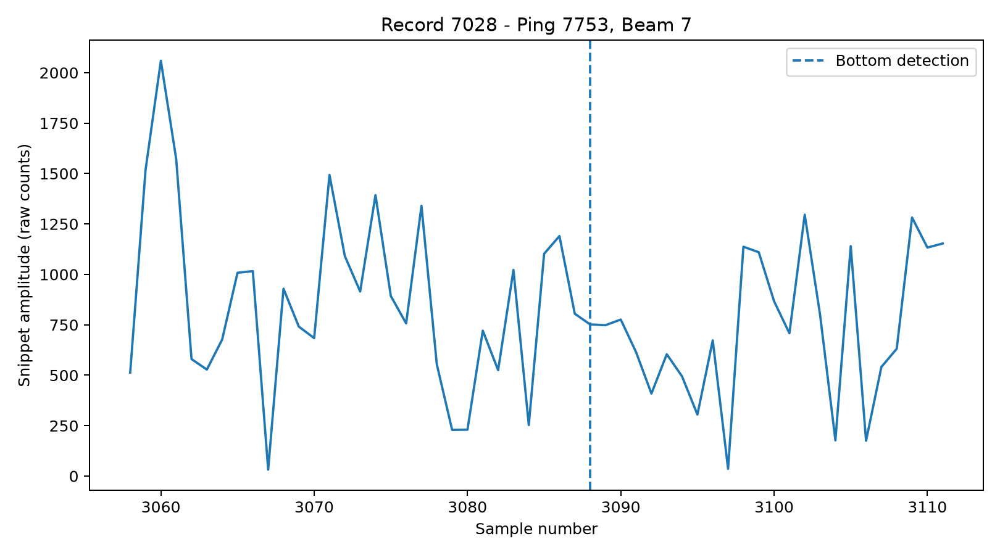
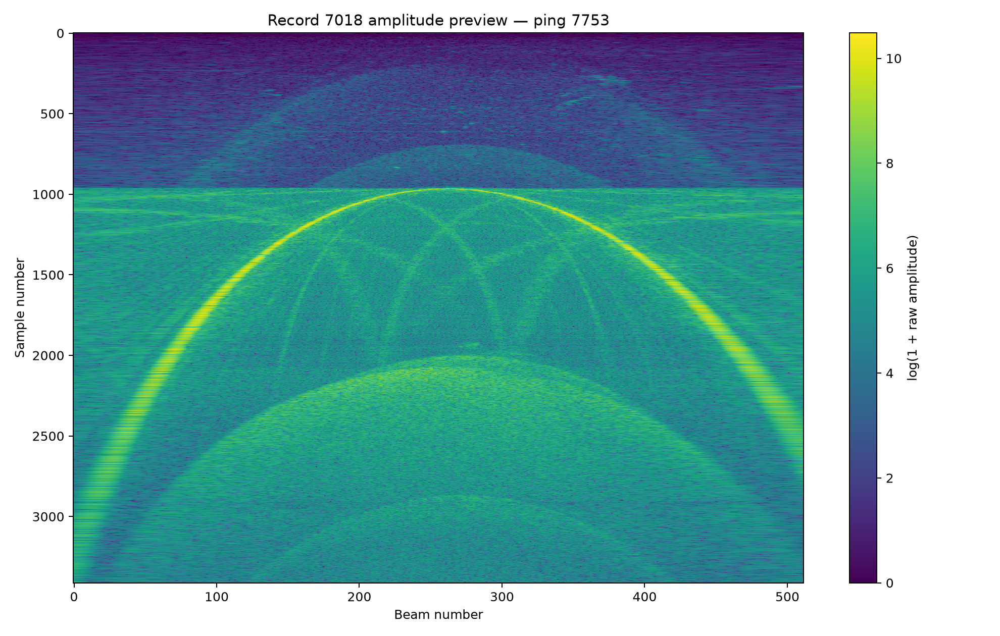

# RESON S7K Datagram Decoder

I started this project in 2023 to see if I could read RESON S7K files with Python. At the time I was mainly interested in Record 7018, which contains beamformed amplitude and phase samples. I later cleaned up the code and added a few scripts for looking at the records in a file.

The reader goes through an S7K file and counts the different record types. It can also read selected records, including sonar settings (7000), beam geometry (7004), TVG (7010), beamformed data (7018), raw detections (7027), and snippets (7028). The example scripts print sonar settings, plot beam geometry and acoustic samples, and export a snippet summary to CSV.

To run it, open the folder in PyCharm or other IDE and install the packages from requirements.txt in your virtual environment:

&#x20;   python -m pip install -r requirements.txt

Open examples/config.py and set S7K\_FILE to the path of your S7K file. For example:

&#x20;   S7K\_FILE = Path(r"D:\\path\\to\\your\\survey.s7k")

Then run the scripts you want from the project folder:

&#x20;   examples/01\_record\_summary.py

&#x20;   examples/02\_sonar\_settings.py

&#x20;   examples/03\_plot\_beam\_geometry.py

&#x20;   examples/04\_plot\_snippet.py

&#x20;   examples/05\_export\_snippets\_csv.py

&#x20;   examples/06\_check\_beamformed.py

&#x20;   examples/07\_plot\_beamformed.py

The first script prints record counts. The second prints settings from Record 7000. The third plots the receive angles from Record 7004. The fourth plots snippet samples from one beam in Record 7028, and the fifth exports a CSV summary of the snippets. The last two scripts check Record 7018 and plot its amplitude by beam and sample number. Figures and CSV files are saved in outputs.

I tested the scripts with a file named 20160330\_085917.s7k. It has 152 Record 7018 entries. The first one is ping 7753, with 512 beams and 3412 samples per beam. The amplitude plot shows a curved strong return that agrees roughly with the bottom detection shown in the snippet data. That gives me some confidence in the sample order, but I have not fully checked the 7018 format or phase scaling.

The 7018 plot is a beam-versus-sample image, not a water-column image positioned by depth and across-track distance. I have only tested this code on one S7K file, so other record variants may need changes. The S7K file is not included in the repository.

Beam geometry:

Snippet samples:

Beamformed amplitude:

# 

# 
Copyright (c) 2023 Musa Animashaun
